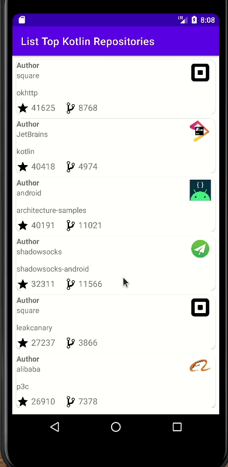
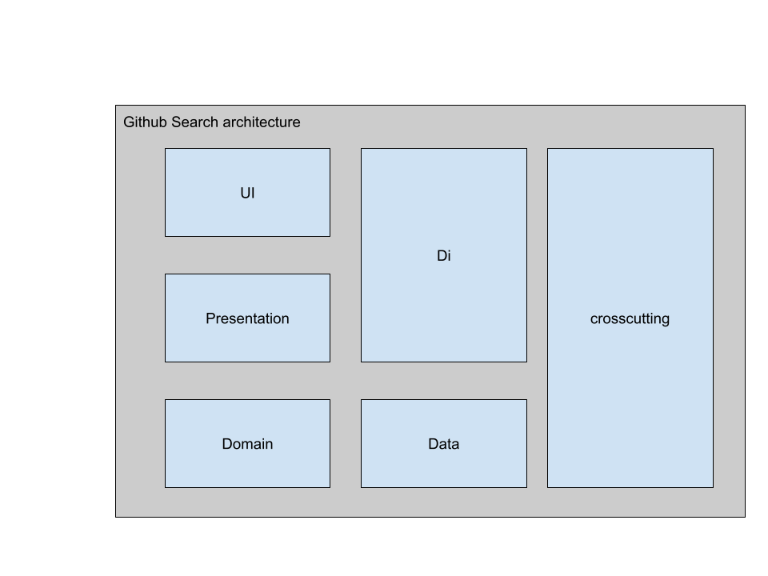

# Latest Github Kotlin repositories


[](http://www.apache.org/licenses/LICENSE-2.0)


</br>

## Description

It is an app that will fetch latest kotlin repositories in github using android jetpack components. 

## Table of contents

- [Latest Github Kotlin repositories](#latest-github-kotlin-repositories)
  - [Description](#description)
  - [Table of contents](#table-of-contents)
  - [Characteristics](#characteristics)
  - [App Screenshot](#app-screenshot)
  - [Tech-stack](#tech-stack)
    - [Tech-stack](#tech-stack-1)
    - [Jetpack](#jetpack)
    - [Tests](#tests)
    - [Static code Analyse](#static-code-analyse)
  - [Architecture](#architecture)
  - [What this project does not cover?](#what-this-project-does-not-cover)
  - [Getting started](#getting-started)
    - [Android Studio](#android-studio)
    - [Command-line](#command-line)
  - [Author](#author)
  - [License](#license)


## Characteristics

This project brings to table set of best practices, tools, and solutions:

* 100% [Kotlin](https://kotlinlang.org/)
* [Android Jetpack](https://developer.android.com/jetpack)
* A single-activity architecture, using the [Navigation component](https://developer.android.com/guide/navigation/navigation-getting-started)
* Testing
* Dependency Injection with [Hilt](https://developer.android.com/training/dependency-injection/hilt-android)
* Static code analyse with [ktlint](https://ktlint.github.io/)
* CI integration by gihub actions

## App Screenshot



## Tech-stack

### Tech-stack

| Technology   	| Description   	|
|---	|---	|
| [Kotlin](https://kotlinlang.org/) + [Coroutines](https://kotlinlang.org/docs/reference/coroutines-overview.html)   	| Perform background operations   	|
| [hilt](https://developer.android.com/training/dependency-injection/hilt-android)   	| Dependency injection   	|
| [Timber](https://github.com/JakeWharton/timber)   	| Logging   	|
| [core-ktx](https://developer.android.com/kotlin/ktx)   	| Kotlin extensions   	|
| [Flow](https://developer.android.com/kotlin/flow?hl=pt-br)   	| Notify views about database change   	|
| [swiperefreshlayout](https://developer.android.com/jetpack/androidx/releases/swiperefreshlayout)   	| Visual refresh layout   	|
| [Cardview](https://developer.android.com/guide/topics/ui/layout/cardview)   	| CardView layout   	|
| [Retrofit](https://square.github.io/retrofit/)   	| A type-safe HTTP client for Android and Java/Kotlin   	|

### [Jetpack](https://developer.android.com/jetpack)

| Technology   	| Description   	|
|---	|---	|
| [Navigation](http://robolectric.org/)   	| Deal with whole in-app navigation   	|
| [Room](https://developer.android.com/jetpack/androidx/releases/room)   	| Database ORM   	|
| [Paging 3](https://developer.android.com/topic/libraries/architecture/paging/v3-overview)   	| Deal with large data in RecycleView   	|
| [ViewModel](https://developer.android.com/topic/libraries/architecture/viewmodel)   	| Store and manage UI-related data in a lifecycle conscious way   	|
| [Constraintlayout](https://developer.android.com/reference/androidx/constraintlayout/widget/ConstraintLayout)   	| Allows to build  flexible layout   	|
| [Test](https://developer.android.com/training/testing/)   	| Tests   	|


### Tests

| Technology   	| Description   	|
|---	|---	|
| [Robolectric](https://en.wikipedia.org/wiki/Unit_testing) |  Run Instrumentation test in JVM |
| [Unit Tests](https://en.wikipedia.org/wiki/Unit_testing) | Unit testing |
[core-testing](https://androidx.tech/artifacts/arch.core/core-testing/)   	| Used to sync background tasks   	|
| [kotlinx-coroutines-test](https://kotlin.github.io/kotlinx.coroutines/kotlinx-coroutines-test/)       | Used to sync coroutines jobs       |
| [mockk](https://mockk.io/)       | Mock objects using kotlin's style       |
| [MockWebServer](https://github.com/square/okhttp/tree/master/mockwebserver)       | Mock http/https requests       |
| [fragment-testing](https://developer.android.com/guide/fragments/test)       | Fragment Test library       |
| [hilt-android-testing](https://developer.android.com/training/dependency-injection/hilt-testing)       | Dependency inject for Test       |
| [Espresso](https://developer.android.com/training/testing/espresso)       | Use Espresso to write concise, beautiful, and reliable Android UI tests.     |

### Static code Analyse

| Technology   	| Description   	|
|---	|---	|
| [Klint](https://ktlint.github.io/#getting-started)   	| An anti-bikeshedding Kotlin linter with built-in formatter.   	|

* Architecture
    * Clean Architecture
    * MVVM (presentation layer)
* Gradle

## Architecture

The application is separated  in modules as displayed below



## What this project does not cover?

NDA.

## Getting started

There are a few ways to open this project.

### Android Studio

1. Android Studio -> File -> New -> From Version control -> Git
2. Enter `https://github.com/thiagoolsilva/github-search` into URL field

### Command-line

1. Run `git clone https://github.com/thiagoolsilva/github-search`
2. Android Studio -> File -> Open

## Author

<table>
    <tr>
        <td align="center"><a href="https://github.com/thiagoolsilva">
            
            <br>
            <sub><b>Thiago Lopes</b></sub>
            <br>
            <a href="https://medium.com/@thiagolopessilva" title="Medium">
                
            </a>
            <a href="https://www.linkedin.com/in/thiago-lopes-silva-2b943a25/" title="Linkedin">
                
            </a>
            <a href="https://twitter.com/thiagoolsilva" title="Twitter">
                
            </a>
        </td>
    </tr>
</table>


## License
```
Copyright (c) 2022  Thiago Lopes da Silva

Licensed under the Apache License, Version 2.0 (the "License");
you may not use this file except in compliance with the License.
You may obtain a copy of the License at

    http://www.apache.org/licenses/LICENSE-2.0

Unless required by applicable law or agreed to in writing, software
distributed under the License is distributed on an "AS IS" BASIS,
WITHOUT WARRANTIES OR CONDITIONS OF ANY KIND, either express or implied.
See the License for the specific language governing permissions and
limitations under the License.
`
